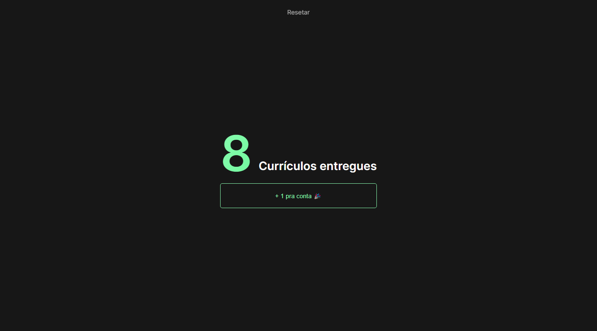

<h1 align="center"> 🔢 CV Count </h1>

  <a href="#-tecnologias">Tecnologias</a>&nbsp;&nbsp;&nbsp;|&nbsp;&nbsp;&nbsp;
  <a href="#-projeto">Projeto</a>&nbsp;&nbsp;&nbsp;|&nbsp;&nbsp;&nbsp;

 

  

## 🚀 Tecnologias

Esse projeto foi desenvolvido com as seguintes tecnologias:

- HTML e CSS
- JavaScript
- [Vite](https://vitejs.dev/)

## 💻 Projeto

Um projeto para contagem de curriculos entregues. Desenvolvido durante o meu curso de ADS na FIAP.
